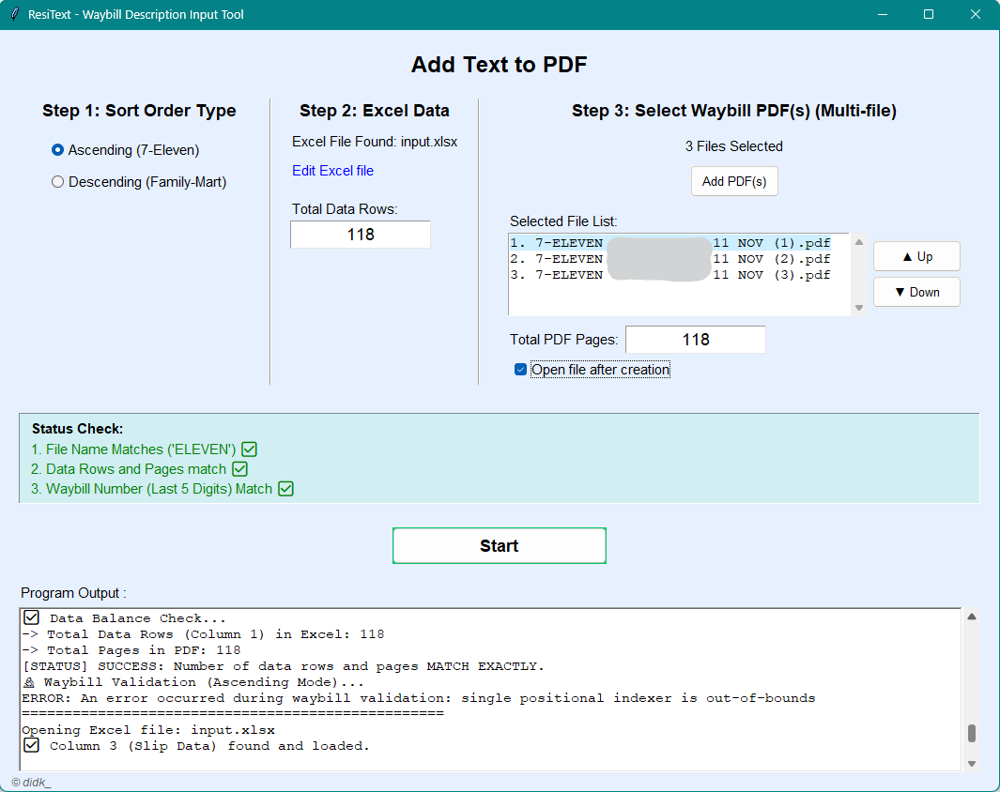

# ResiText - Waybill Description Automation Tool

## Overview

**ResiText** is a Python application that automates the process of adding product descriptions and special notes to waybill (resi) PDF files. It connects data from Excel files to PDF documents, making batch input fast and accurate. This tool is ideal for e-commerce logistics and fulfillment centers that need to print waybills with product details already included. ResiText can reduce manual processing time by up to 95%.

## Application Preview



*The image above shows the application's interface with a three-step verification system to ensure data accuracy before processing.*


## Features

### 1. Three-Step Data Validation
Before processing, the app performs three automatic checks to prevent errors:

- **File Name Check:** Ensures selected PDF files contain the required keyword (`ELEVEN` for Ascending/7-Eleven, `FAMI` for Descending/Family-Mart) based on the chosen sort order.
- **Data Count Match:** Verifies that the number of data rows in Excel matches the total number of pages in all selected PDF files.
- **Waybill Number Validation (Ascending only):** Automatically checks the last 5 digits of the waybill number in the PDF against the value in Excel (Column G/7). This eliminates manual entry and ensures accuracy.

### 2. Smart Text Insertion
- **Product Description Input:** Reads product descriptions from Excel (Column A) and inserts them into each PDF page at a fixed position.
- **Dual Sorting Modes:** Supports Ascending (top-to-bottom) and Descending (bottom-to-top) order, adapting to different logistics partners.
- **Special Instruction Handling:** Detects keywords (e.g., '60') in the notes column (Column C) and adds a warning (`(INSERT 60 NT !!)`) before the product description.
- **Rotated and Centered Text:** Inserts, rotates, and centers the text on the waybill, with automatic word wrapping for long descriptions.

### 3. Workflow and Usability
- **Automatic Excel Refresh:** Detects changes in the Excel file and updates the data count in real time.
- **PDF Order Adjustment:** Lets users change the order of selected PDF files using ▲ Up / ▼ Down buttons.
- **Auto-Open Output:** Optionally opens the final PDF automatically after processing.
- **Edit Excel Directly:** "Edit file Excel" button opens the source Excel file for quick edits.


## Prerequisites

- Python 3.x or newer
- Excel file (`.xlsx` or `.xls`) with the required structure
- PDF waybill files ready for processing

## Installation

1. **Download and Place Files**
    - Put `ResiText.py` and your Excel file in the same folder

2. **Install Dependencies**
    Open a terminal in the ResiText folder and run:
    ```bash
    pip install pandas PyPDF2 reportlab pdfplumber openpyxl
    ```

3. **Run the Application**
    ```bash
    python ResiText.py
    ```

## Usage Guide

1. **Choose Sort Order**
    - Select Ascending (7-Eleven) or Descending (Family-Mart)
    - This affects file validation and processing order

2. **Prepare Excel Data**
    - Make sure your Excel file is in the same folder
    - Click "Edit file Excel" to view or edit data
    - The app will show the total data rows automatically

3. **Select PDF Files**
    - Click "Add PDF(s)" to select one or more waybill files
    - The app will validate file names and show a list

4. **Verify Data**
    - Check the status indicators below the file list
    - All three should be green (✅) before starting

5. **Adjust PDF Order (Optional)**
    - Select a file in the list and use ▲ or ▼ to change its position

6. **Start Processing**
    - Click "Start" and choose where to save the output PDF
    - The file will open automatically if the option is enabled

## Required Excel Structure

The app reads data from specific columns in Excel:

| Column | Name                | Purpose                                         | Required?                |
|:------:|:-------------------:|:----------------------------------------------- |:------------------------:|
|   A    | Item Description    | Main text (product name/description) for PDF    | Yes                      |
|   C    | Special Notes       | For detecting instructions (e.g., '60')         | Yes                      |
|   G    | Waybill Number      | For validation in Ascending mode                | Yes (Ascending only)     |

### Example Excel Format

| A                    | B    | C     | ... | G     |
|----------------------|------|-------|-----|-------|
| Children's Storybook | Shop | 60    | ... | 12345 |
| Robot Toy            | Shop |       | ... | 12346 |
| Sports Shoes Size 42 | Shop | 60    | ... | 12347 |

## Troubleshooting

- **File Name DOES NOT Match:**
  - Make sure PDF file names contain the correct keyword for the selected mode (ELEVEN for Ascending, FAMI for Descending)
- **Data Rows and Pages DO NOT match:**
  - Check that the number of rows in Excel matches the total PDF pages
- **Waybill Number DOES NOT Match:**
  - Verify column G in Excel matches the waybill numbers in the PDFs
- **Output PDF does not open automatically:**
  - Enable the "Open file after creation" checkbox before starting

## Notes

- Always back up your Excel and PDF files before using the app
- Double-check data before processing large batches
- Make sure the PDF file order is correct before starting
- The app will show clear error messages if something is wrong

## License

Developed to simplify e-commerce logistics processes.

**Developer:** © didk_